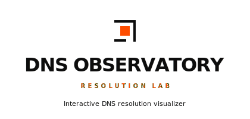
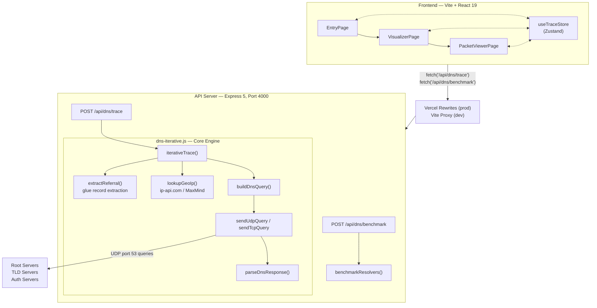

<p align="center">
  <br />
  <picture>
    <source media="(prefers-color-scheme: dark)" srcset=".github/assets/banner-dark.svg" />
    <source media="(prefers-color-scheme: light)" srcset=".github/assets/banner-light.svg" />
    
  </picture>
</p>


<p align="center">
  
  
  
  
  
</p>

<p align="center">
  <a href="https://dns-observatory.vercel.app/">
    
  </a>
</p>

<br />

## What is DNS Observatory?

DNS Observatory traces the **full iterative resolution path** of any domain name from root servers to authoritative nameservers and visualizes every hop with per-server latency, GeoIP metadata, DNSSEC presence flags, and raw wire-format packet bytes.

It includes a **client-side PCAP exporter** that reconstructs Ethernet, IP, and UDP headers for Wireshark analysis, and a **resolver benchmark** comparing Cloudflare and Google query latency side-by-side.

---

## Features

### 🔬 Iterative DNS Tracing

- Full iterative resolution path: **Client → Local DNS → Root → TLD → Authoritative**
- Per-hop RTT measurement with cumulative latency waterfall
- CNAME chain following with automatic re-resolution (up to 4 levels deep)
- Configurable resolver selection (Cloudflare `1.1.1.1`, Google `8.8.8.8`, Quad9 `9.9.9.9`, or custom IP)
- Batch `ALL` type queries resolves A, AAAA, MX, TXT, NS in parallel against the authoritative server

### 🌍 GeoIP Enrichment

- API-first lookup via `ip-api.com` for maximum accuracy
- Local fallback using MaxMind GeoLite2 City & ASN databases
- Country flag emoji rendering from ISO country codes
- ASN / ISP organization identification
- LRU cache (500 entries) to minimize redundant lookups
- Private/loopback IP detection with automatic local placeholders

### 📦 Packet Inspection

- Full DNS response dissection: header flags, questions, answers, authority, additional sections
- Raw hex byte viewer with interactive field highlighting
- Request vs response packet tab switching
- Per-attempt protocol tracking (UDP → TCP failover visibility)
- Wireshark-ready **PCAP export** single hop or full trace session

### 🧬 PCAP Export Engine

- Client-side packet reconstruction builds Ethernet, IPv4/IPv6, UDP/TCP headers from raw DNS bytes
- Full TCP session synthesis: SYN → SYN-ACK → ACK → PSH-ACK (data) → FIN-ACK → ACK
- Correct IP checksums, proper TCP sequence/acknowledgment numbers
- Connection failure simulation (RST-ACK for refused, truncated SYN for timeout)
- Downloads valid `.pcap` files openable in Wireshark, tcpdump, tshark

### ⚡ Resolver Benchmark

- Parallel latency comparison: Cloudflare (1.1.1.1) vs Google (8.8.8.8)
- Per-resolver RCODE, answer count, and individual record display
- Runs concurrently with the iterative trace

### 🎯 Visualizer Interface

- Interactive SVG delegation tree with animated hop progression
- Animated playback with play/pause, step forward/backward, replay, and slow-mo controls
- Keyboard shortcuts: `Space` (play/pause), `←/→` (step), `R` (replay), `Esc` (exit)
- CNAME chain explorer with visual redirection path
- Hierarchical record inspector with grouped answer/authority/additional sections
- Live TTL countdown with cache expiry stamps on individual records
- Resolver console log stream with per-hop protocol details
- Resizable split panels with drag handle
- Lab Notes overlay with contextual DNS educational content

### 🔒 Protocol Support

- EDNS0 (OPT record) with 1232-byte UDP payload size advertisement
- DNSSEC visibility: RRSIG, DNSKEY, DS record parsing and presence flags
- Automatic UDP → TCP failover on truncated responses (TC flag)
- Transaction ID matching to prevent stray packet acceptance

### 🛡️ Backend Hardening

- Sliding window rate limiter (100 requests / 15 minutes per IP)
- Domain name sanitization with regex validation
- Record type whitelist enforcement
- Graceful shutdown with SIGINT handler
- Structured logging via Pino with HTTP request correlation

---

## Architecture



---

## Tech Stack

| Layer | Technology |
|---|---|
| **Frontend** | React 19, Vite 8, Tailwind CSS 4, Zustand, Framer Motion, Lucide Icons |
| **Backend** | Node.js 22, Express 5, Pino (structured logging) |
| **DNS** | Raw UDP/TCP sockets (`dgram`, `net`), from-scratch binary parser/writer |
| **GeoIP** | ip-api.com (primary), MaxMind GeoLite2 MMDB (fallback) |
| **Compiler** | React Compiler (babel-plugin-react-compiler) |
| **DevOps** | Docker, Vercel (frontend), Render (backend) |
| **Code Quality** | ESLint 10, Husky, lint-staged, Commitizen, conventional commits |
| **API Collection** | Bruno |

---

## Getting Started

### Prerequisites

- **Node.js** ≥ 22
- **npm** ≥ 10

### Installation

```sh
# Clone the repository
git clone https://github.com/Owaisshaikh11/DNS-Observatory.git
cd DNS-Observatory

# Install all workspace dependencies
npm install
```

The `postinstall` script automatically downloads the MaxMind GeoLite2 databases for local GeoIP fallback.

### Running Locally

```sh
# Start both the API server and Vite dev server concurrently
npm run dev
```

This starts:

- **API server** at `http://localhost:4000`
- **Vite dev server** at `http://localhost:5173`

### Individual Services

```sh
# API server only
npm run start:server

# Vite frontend only
npm run start:app
```

---

## Docker

```sh
# Build and run with Docker Compose
docker compose up

# Or build the image directly
docker build -t dns-observatory .
docker run -p 4000:4000 dns-observatory
```

### Environment Variables

| Variable | Default | Description |
|---|---|---|
| `API_PORT` | `4000` | Express API server port |
| `NODE_ENV` | — | Set to `production` to serve static frontend from `app/dist` |
| `CORS_ORIGINS` | — | Comma-separated allowed origins for CORS |

---

## API Reference

### `POST /api/dns/trace`

Runs a full iterative DNS trace from root to authoritative nameserver.

**Request:**

```json
{
  "domain": "github.com",
  "type": "A",
  "resolver": "1.1.1.1"
}
```

**Response:**

```json
{
  "domain": "github.com",
  "recordType": "A",
  "status": "NOERROR",
  "totalLatency": 342,
  "dnssecPresent": true,
  "answers": [{ "typeName": "A", "value": "140.82.121.3", "ttl": 60 }],
  "cnameChain": [],
  "hopCount": 5,
  "hops": [{ "id": "client-0", "type": "CLIENT", "latencyMs": 0, "geo": {} }],
  "edges": [{ "from": "client-0", "to": "local-0", "label": "Query github.com A" }],
  "timestamp": 1719200000000
}
```

**Supported types:** `A`, `AAAA`, `MX`, `TXT`, `NS`, `CNAME`, `SOA`, `PTR`, `SRV`, `ALL`

---

### `POST /api/dns/benchmark`

Compares Cloudflare (1.1.1.1) vs Google (8.8.8.8) resolution latency.

**Request:**

```json
{ "domain": "example.com", "type": "A" }
```

**Response:**

```json
{
  "cloudflare": { "resolver": "Cloudflare", "ip": "1.1.1.1", "latencyMs": 12, "rcode": "NOERROR", "answers": [] },
  "google": { "resolver": "Google", "ip": "8.8.8.8", "latencyMs": 24, "rcode": "NOERROR", "answers": [] },
  "domain": "example.com",
  "recordType": "A"
}
```

---

## Project Structure

```
DNS-Observatory/
├── app/                            # Frontend + API server workspace
│   ├── src/
│   │   ├── pages/
│   │   │   ├── EntryPage.jsx       # Landing page with domain input
│   │   │   ├── VisualizerPage.jsx  # Resolution lab with tree + waterfall + inspector
│   │   │   ├── PacketViewerPage.jsx# Hex viewer + PCAP export
│   │   │   └── NotFoundPage.jsx    # Animated 404 with error telemetry
│   │   ├── components/
│   │   │   ├── CompactTree.jsx     # Interactive SVG delegation tree
│   │   │   ├── HopCard.jsx         # Per-hop detail card
│   │   │   ├── HopInspector.jsx    # Side panel packet inspector
│   │   │   ├── HexViewer.jsx       # Raw hex byte viewer
│   │   │   ├── RecordTable.jsx     # DNS record table
│   │   │   └── ...                 # BentoBox, Footer, FlagBadge, etc.
│   │   ├── stores/
│   │   │   └── useTraceStore.js    # Global trace state (Zustand)
│   │   └── utils/
│   │       ├── pcapExporter.js     # Client-side PCAP reconstruction
│   │       └── dnsFormatter.js     # Record value formatting
│   └── server/
│       ├── index.js                # Express API server entry point
│       ├── dns-iterative.js        # Core iterative resolution engine
│       ├── geoip-service.js        # GeoIP lookup (API + MMDB fallback)
│       ├── root-hints.js           # IANA root server list
│       └── lib/                    # Binary packet parsing and writing libraries
│           ├── types.js            # DNS header flags and record types
│           ├── dns-parser.js       # Binary DNS response parser
│           └── dns-writer.js       # Binary DNS query builder
│
├── bruno-collection/               # Bruno API collection
├── Dockerfile                      # Multi-stage Docker build
├── docker-compose.yml              # Docker Compose config
└── package.json                    # Root workspace configuration
```

---

## Known Limitations

- **Free-tier hosting**: The backend runs on Render's free tier, which spins down after inactivity. The first request after idle may take 30–60 seconds for cold start.
- **No recursive caching**: The iterative resolver intentionally bypasses caching to demonstrate the full resolution path every time.
- **GeoIP accuracy**: The free ip-api.com tier is rate-limited to 45 requests/minute. High-traffic usage will fall back to the less precise local MaxMind databases (city-level fallback).

---

## Roadmap

Future planned enhancements for the DNS Observatory platform:
* **DNS-over-HTTPS (DoH) / DNS-over-TLS (DoT):** Support tracing and parsing encrypted DNS request streams.
* **DNSSEC Chain of Trust Validator:** Build a strict visual validator confirming cryptographic keys down from the root zone anchors.

---

## License

© 2026 Owais Shaikh. All rights reserved.

---

<p align="center">
  <sub>Built with ❤️ by <a href="https://github.com/Owaisshaikh11">Owaiss</a></sub>
</p>
